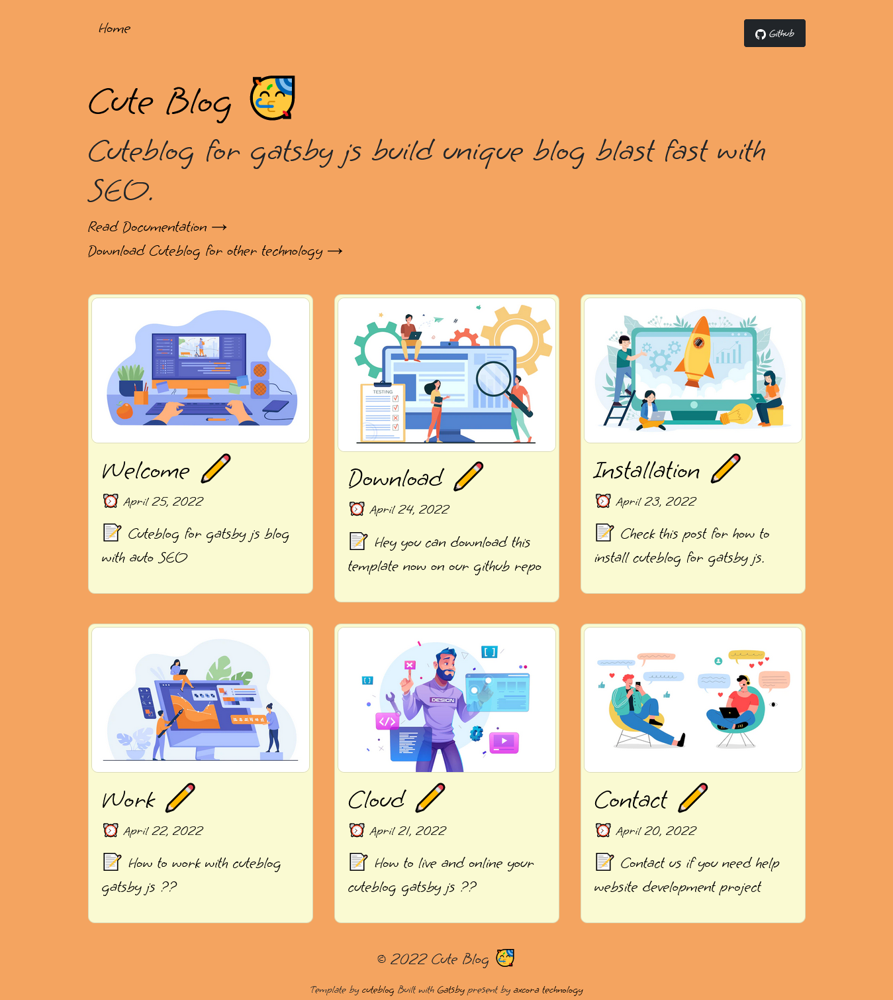

    

<h1 align="center">
  Gatsby's cute blog
</h1>

### 🚀 Blast fast blog with auto SEO

build modern web app blog using gatsby js

Documentation : [https://www.hockeycomputindo.com/2022/04/modern-blog-with-gatsby-cuteblog-free.html](https://www.hockeycomputindo.com/2022/04/modern-blog-with-gatsby-cuteblog-free.html)

Test demo via shared hosting deploy : [https://cutegatsby.axcora.my.id →](https://cutegatsby.axcora.my.id/)

Test demo via gatsby cloud deploy : [https://cuteblog.gatsbyjs.io/ →](https://cuteblog.gatsbyjs.io)

------------------------

##### DISPLAY

Home page

Article page

-------------------------

Documentation : [https://www.hockeycomputindo.com/2022/04/modern-blog-with-gatsby-cuteblog-free.html](https://www.hockeycomputindo.com/2022/04/modern-blog-with-gatsby-cuteblog-free.html)

Test demo via gatsby cloud deploy : [https://cuteblog.gatsbyjs.io/ →](https://cuteblog.gatsbyjs.io)

Test demo via shared hosting deploy : [https://cutegatsby.axcora.my.id →](https://cutegatsby.axcora.my.id/)
